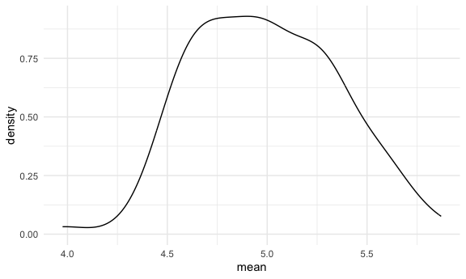
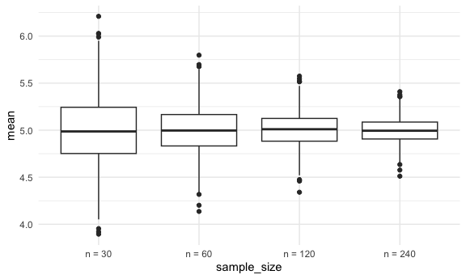
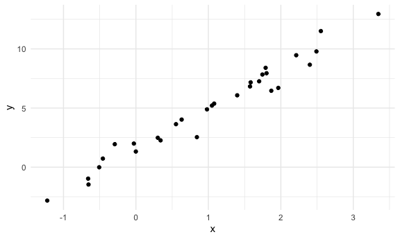
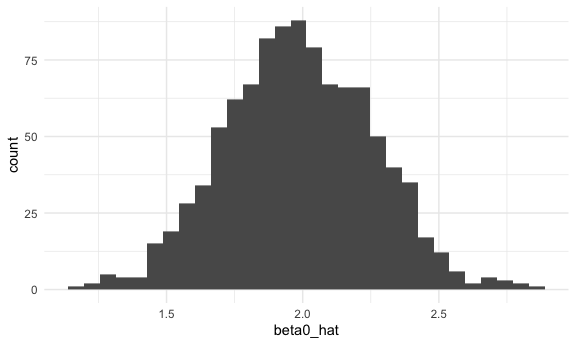
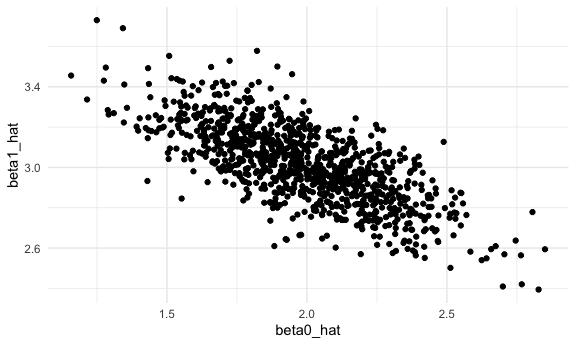

Simulation
================

load packages

``` r
library(tidyverse)
```

    ## ── Attaching core tidyverse packages ──────────────────────── tidyverse 2.0.0 ──
    ## ✔ dplyr     1.1.3     ✔ readr     2.1.4
    ## ✔ forcats   1.0.0     ✔ stringr   1.5.0
    ## ✔ ggplot2   3.4.3     ✔ tibble    3.2.1
    ## ✔ lubridate 1.9.2     ✔ tidyr     1.3.0
    ## ✔ purrr     1.0.2     
    ## ── Conflicts ────────────────────────────────────────── tidyverse_conflicts() ──
    ## ✖ dplyr::filter() masks stats::filter()
    ## ✖ dplyr::lag()    masks stats::lag()
    ## ℹ Use the conflicted package (<http://conflicted.r-lib.org/>) to force all conflicts to become errors

``` r
library(rvest)
```

    ## 
    ## Attaching package: 'rvest'
    ## 
    ## The following object is masked from 'package:readr':
    ## 
    ##     guess_encoding

setup

``` r
knitr::opts_chunk$set(
  fig.width = 6,
  fig.asp = .6,
  out.width = "90%"
)

theme_set(theme_minimal() + theme(legend.position = "right"))

options(
  ggplot2.continuous.colour = "viridis",
  ggplot2.continuous.fill = "viridis"
)

scale_colour_discrete = scale_colour_viridis_d
scale_fill_discrete = scale_fill_viridis_d
```

set seed

``` r
set.seed(12345)
```

# Simulate mean and sd

``` r
sim_mean_sd = function(n_obs, mu = 5, sigma = 2) {
  
  x_vec = rnorm(n = n_obs, mu, sigma)
  
  tibble(
    mean = mean(x_vec),
    sd = sd(x_vec)
  )
  
}
```

``` r
sim_mean_sd(n_obs = 30)
```

    ## # A tibble: 1 × 2
    ##    mean    sd
    ##   <dbl> <dbl>
    ## 1  5.16  1.88

Iterate to see how this works under repeated sampling

``` r
output = vector("list", length = 100)

for (i in 1:100) {
  
  output[[i]] = sim_mean_sd(n_obs = 30)
  
}

sim_results = 
  bind_rows(output)

sim_results 
```

    ## # A tibble: 100 × 2
    ##     mean    sd
    ##    <dbl> <dbl>
    ##  1  5.62  2.57
    ##  2  5.87  2.17
    ##  3  5.05  2.07
    ##  4  4.89  2.45
    ##  5  5.01  2.01
    ##  6  5.27  1.55
    ##  7  5.11  2.03
    ##  8  5.01  1.84
    ##  9  4.63  1.79
    ## 10  5.66  2.06
    ## # ℹ 90 more rows

``` r
sim_results |> 
  ggplot(aes(x = mean)) + geom_density()
```



``` r
sim_results |> 
  summarize(
    mu_hat = mean(mean),
    sd_hat = sd(mean)
  )
```

    ## # A tibble: 1 × 2
    ##   mu_hat sd_hat
    ##    <dbl>  <dbl>
    ## 1   4.99  0.360

avg all estimate should be about true parameter values

Can use a map function instead creating dataset using expand grid all
combos of sample size 30 and iter using iter just to keep track

``` r
sim_result_df <- 
  expand_grid(
    sample_size = 30,
    iter = 1:100
  ) |> 
  mutate(estimate_df = map(sample_size, sim_mean_sd)) |> 
  unnest(estimate_df)
```

Multiple diff sample sizes 1000 rows where sample size is 30, 1000 rows
where sample size is 60 etc; all combos

``` r
sim_result_df <- 
  expand_grid(
    sample_size = c(30, 60, 120, 240),
    iter = 1:1000
  ) |> 
  mutate(estimate_df = map(sample_size, sim_mean_sd)) |> 
  unnest(estimate_df)

tail(sim_result_df)
```

    ## # A tibble: 6 × 4
    ##   sample_size  iter  mean    sd
    ##         <dbl> <int> <dbl> <dbl>
    ## 1         240   995  5.13  1.95
    ## 2         240   996  4.87  1.89
    ## 3         240   997  4.80  1.88
    ## 4         240   998  4.89  1.93
    ## 5         240   999  4.81  2.11
    ## 6         240  1000  4.90  2.18

``` r
sim_result_df |> 
  mutate(sample_size = str_c("n = ", sample_size),
         sample_size = fct_inorder(sample_size)) |> 
  ggplot(aes(x = sample_size, y = mean)) +
  geom_boxplot()
```


made sample size “n =” label; made it a character variable

linear regression example goal is to write a function that simulates
data and then fits a regression; then repeat to look at the distribution
of estimated coefficients

``` r
beta_0 = 2
beta_1 = 3

sim_data = 
  tibble(
    x = rnorm(n = 30, mean = 1, sd = 1),
    y = beta_0 + beta_1 * x + rnorm(30, mean = 0, sd = 1)
  )

ls_fit = lm(y ~ x, data = sim_data)
ls_fit
```

    ## 
    ## Call:
    ## lm(formula = y ~ x, data = sim_data)
    ## 
    ## Coefficients:
    ## (Intercept)            x  
    ##       1.543        3.355

``` r
sim_data |> 
  ggplot(aes(x = x, y = y)) +
  geom_point()
```



let’s wrap this in a function

``` r
sim_slr = function(n_obs, beta_0 = 2, beta_1 = 3) {
  
  sim_data = 
  tibble(
    x = rnorm(n = n_obs, mean = 1, sd = 1),
    y = beta_0 + beta_1 * x + rnorm(n_obs, mean = 0, sd = 1)
  )
  
  ls_fit = lm(y ~ x, data = sim_data)
  
  tibble(
    beta0_hat = coef(ls_fit)[1],
    beta1_hat = coef(ls_fit)[2]
  )

}

sim_slr(n_obs = 30)
```

    ## # A tibble: 1 × 2
    ##   beta0_hat beta1_hat
    ##       <dbl>     <dbl>
    ## 1      2.12      2.92

what if we do this process a 1000 times?

``` r
sim_results_df = 
  expand_grid(
    sample_size = 30,
    iter = 1:1000
  ) |> 
  mutate(estimate_df = map(sample_size, sim_slr)) |> 
  unnest(estimate_df)
```

let’s look at the results

``` r
sim_results_df |> 
  summarize(
    mean_b0_hat = mean(beta0_hat),
    mean_b1_hat = mean(beta1_hat)
  )
```

    ## # A tibble: 1 × 2
    ##   mean_b0_hat mean_b1_hat
    ##         <dbl>       <dbl>
    ## 1        1.99        3.01

``` r
sim_results_df |> 
  ggplot(aes(x = beta0_hat)) +
  geom_histogram()
```

    ## `stat_bin()` using `bins = 30`. Pick better value with `binwidth`.



``` r
sim_results_df |> 
  ggplot(aes(x = beta0_hat, y = beta1_hat)) +
  geom_point()
```


here estimated intercept is smaller and estiamted slope is high; beta 0
and 1 are neg correlated little low intercept so steeper line
